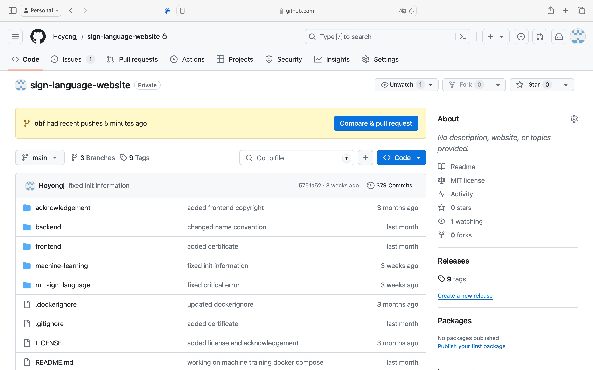
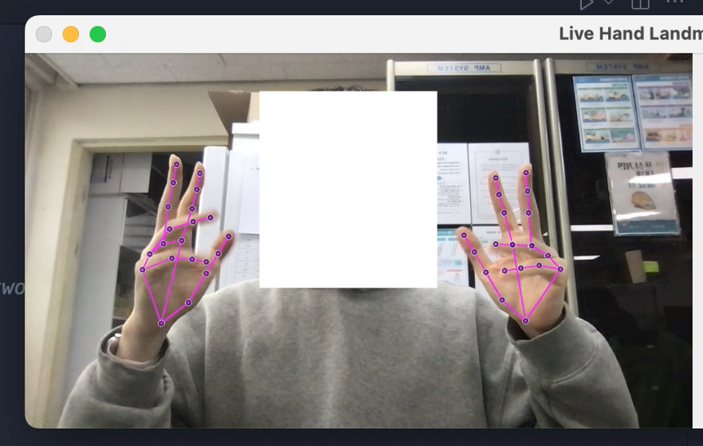
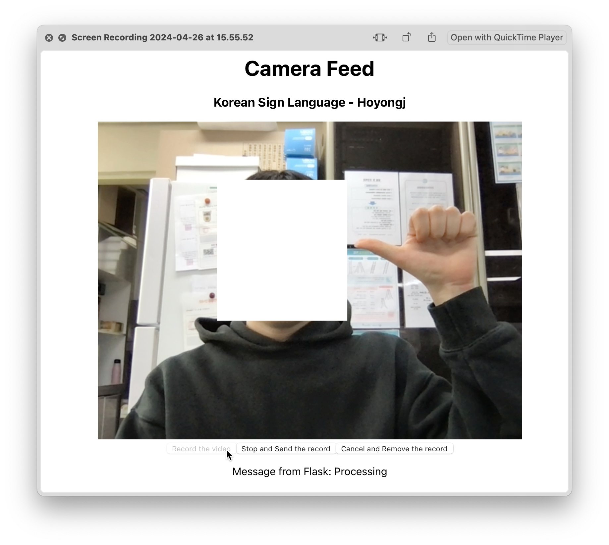
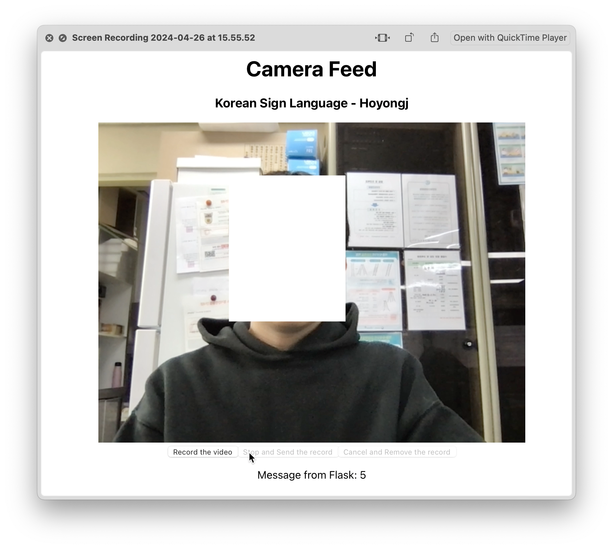

# Sign-Language-Website-Public

## Table of Contents
1. [Introduction](#1-introduction)
2. [How Does the Model Work](#2-how-does-the-model-work)
3. [How to Run the Server](#3-how-to-run-the-server)
4. [Demonstration](#4-demonstration)

## 1. Introduction

I worked on a **Korean Sign Language (KSL)** recognition project for about 4 months. As I plan to open the main repository later, I will provide an overall demonstration of my project in this repository. Currently, only numbers between 0 and 10 can be recognized. I trained the model with this [Dataset](https://www.aihub.or.kr/aihubdata/data/view.do?currMenu=115&topMenu=100&dataSetSn=264).



## 2. How Does the Model Work

First, I extracted landmark points from videos using **Google - MediaPipe**.



(This is me.)

Then, I built a neural network model using **Long Short-Term Memory (LSTM)** layers.


(Images from Wikipedia)

## 3. How to Run the Server

Requirements: Docker (with compose)

The operating system may not matter.

```shell
#!/bin/bash
docker-compose up
```

(Note that the backend server may require time to get ready.)

Then, visit [http://localhost](http://localhost),

And allow the browser to use the webcam.

## 4. Demonstration





This is a real demonstration using the above `docker-compose.yml`.

## P.S.

If you have any questions, feel free to ask me.

## Reference

* Google - MediaPipe
* OpenCV
* Long Short-Term Memory - Wikipedia
* Neural Network (Machine Learning) - Wikipedia
